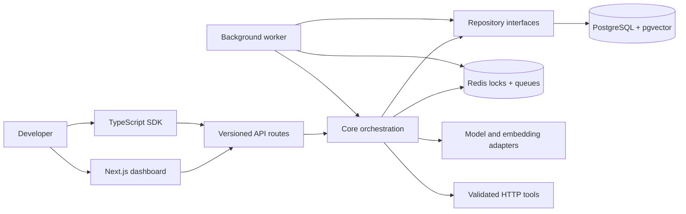

<div align="center">

# Memory Orchestration Debugger

### Make AI-agent memory observable, explainable, and testable.

A developer tool for inspecting how an AI agent retrieves, ranks, applies, updates, and forgets memory—with durable traces for every run.

[](https://www.typescriptlang.org/)
[](https://nextjs.org/)
[](https://github.com/pgvector/pgvector)
[](https://www.prisma.io/)
[](https://pnpm.io/)

[Architecture](docs/architecture.md) · [Delivery plan](PLAN.md) · [Quick start](#quick-start)

</div>

## Why this project exists

Long-term memory can make an AI agent useful across conversations, but it also creates a difficult debugging problem. When an answer is wrong, ordinary logs rarely explain:

- which memories were retrieved and which were excluded;
- how semantic similarity, recency, importance, and confidence affected rank;
- what was actually placed in the model context;
- whether a fact was updated, duplicated, contradicted, summarized, or expired;
- what a tool received, returned, and exposed to the model.

This project treats those decisions as first-class, structured data. Each agent request becomes an observable run that can be inspected, compared, and evaluated instead of reconstructed later from unstructured logs.

> The goal is not merely to give an agent memory. The goal is to make memory behavior debuggable.

## Target MVP

| Capability             | What the finished debugger is designed to show                                   |
| ---------------------- | -------------------------------------------------------------------------------- |
| Memory retrieval       | Every candidate considered for the current agent and user                        |
| Deterministic ranking  | Semantic, recency, importance, confidence, and type-boost score components       |
| Context selection      | Exact included memories, exclusion reasons, ordering, and token-budget decisions |
| Memory evolution       | Canonical-key updates, revisions, contradictions, expiration, and soft deletion  |
| Safe HTTP tools        | Validated arguments, SSRF defenses, bounded execution, and sanitized traces      |
| Replay and evaluations | Side-by-side configurations and deterministic behavioral assertions              |
| Developer access       | A Next.js debugger dashboard and a typed TypeScript SDK                          |

## Current implementation status

The repository is being delivered milestone by milestone. It deliberately distinguishes implemented foundations from the complete product vision.

### Implemented foundation

- pnpm workspace organized as a modular monolith plus one background worker
- strict TypeScript configuration and enforced package boundaries
- Next.js application shell, dependency-aware health endpoint, and worker entry point
- PostgreSQL/Prisma domain schema with a pgvector migration and intentional indexes
- memory repository primitives for vector retrieval, scoped active-memory queries, revisions, optimistic concurrency, and soft deletion
- dependency-injected agent-run service contracts and an observable orchestration lifecycle
- deterministic demo workspace, agent, user, and order seed data
- Vitest unit tests, database integration tests, Playwright scaffolding, linting, type checking, builds, and GitHub Actions CI

### In active development

- public API routes and OpenAI/OpenAI-compatible provider adapters
- end-to-end application wiring for the orchestration contracts
- memory extraction, consolidation, and contradiction workflows
- bounded, schema-validated HTTP tool execution
- the interactive debugger dashboard and trace views
- immutable replay, deterministic evaluation suites, and the public SDK

See [PLAN.md](PLAN.md) for acceptance criteria and granular progress. Roadmap capabilities below describe the intended MVP unless explicitly listed as implemented above.

## Architecture

The design favors a modular monolith: transactional state stays together, while business logic remains isolated from HTTP, framework, database, and model-provider details.



| Boundary             | Responsibility                                                                        |
| -------------------- | ------------------------------------------------------------------------------------- |
| `apps/web`           | Dashboard, authentication, API boundary, dependency wiring, and streaming transport   |
| `apps/worker`        | BullMQ registration and worker dependency wiring                                      |
| `packages/core`      | Run orchestration, retrieval, ranking, context, tools, consolidation, and evaluations |
| `packages/db`        | Prisma, transactions, repositories, migrations, and all pgvector SQL                  |
| `packages/contracts` | Public Zod schemas and shared request, response, and event types                      |
| `packages/sdk`       | Framework-independent TypeScript client                                               |
| `packages/ui`        | Shared presentation components                                                        |

The full rationale and data model are documented in [docs/architecture.md](docs/architecture.md).

## An observable agent run

The target lifecycle makes every consequential transition durable and inspectable:


Immediate consolidation is designed to finish before the per-conversation lock is released, so the next turn can see a newly stored preference. Background work is reserved for maintenance such as summarization, expiration sweeps, and re-embedding.

## Deterministic memory ranking

The default ranking policy combines observable score components:

```text
final score =
  semantic similarity × 0.50 +
  recency            × 0.20 +
  importance         × 0.15 +
  confidence         × 0.10 +
  type boost         × 0.05
```

The system is designed to persist the inputs to that calculation, not ask a model to invent a post-hoc explanation.

```text
Included at rank 2: semantic 0.88, recency 0.94, importance 0.82,
confidence 0.96, preference boost 1.00, final score 0.89.

Excluded: duplicate canonical key; newer active memory selected.
Excluded: memory context token budget exhausted.
Excluded: expired at 2026-07-01T00:00:00Z.
```

That distinction matters: the debugger exposes reproducible application decisions without exposing or fabricating private model reasoning.

## Memory that evolves without losing history

Updateable concepts receive canonical keys such as `preference.delivery_location`. The repository's memory primitives support a single active value while preserving its history:

1. Locate the active memory for the agent, user, and canonical key.
2. Verify its expected version.
3. Save the prior content and metadata as a revision in the same transaction.
4. Update the existing memory and increment its version.
5. Refresh the embedding whenever semantic content changes.

This avoids treating every corrected fact as a new, equally current memory and keeps prior evidence available for debugging.

### Concrete demo scenario

```text
User:  "Please deliver future orders to my Pittsburgh apartment."
Agent: stores one USER_PREFERENCE with key preference.delivery_location

User:  "Where is my latest order?"
Agent: retrieves the preference, calls get_latest_order, and traces both decisions

User:  "Use my New Jersey address instead."
Agent: updates the same active memory; the Pittsburgh value remains in revision history
```

The completed demo will expose the selected memory, score breakdown, exact context, sanitized tool request and response, latency, token use, estimated cost, mutation, and revision from both the dashboard and SDK.

## Security is an architectural constraint

The target system is designed around hostile inputs and secret-bearing integrations:

- application API keys are hashed; third-party credentials are encrypted and referenced by ID;
- authorization headers, cookies, tokens, passwords, and configured sensitive fields are redacted before persistence;
- HTTP tools validate schemas, methods, DNS results, IP ranges, redirects, timeouts, and response sizes;
- loopback, private, link-local, multicast, and cloud-metadata destinations are blocked by production defaults;
- provider and tool failures are normalized into sanitized errors;
- all raw SQL and pgvector operations remain inside `packages/db` and use parameterized values;
- default tests use deterministic mock providers rather than paid live model calls.

## Quick start

### Prerequisites

- Node.js 20.9 or newer
- pnpm 11.7
- Docker with Compose

```bash
git clone https://github.com/ri-shenvi/agent-memory-orchestration.git
cd agent-memory-orchestration
pnpm install
```

Create a local environment file in PowerShell:

```powershell
Copy-Item .env.example .env
```

Start PostgreSQL with pgvector and Redis, prepare the database, and launch the web app and worker:

```bash
docker compose up -d
pnpm db:generate
pnpm db:migrate
pnpm db:seed
pnpm dev
```

Open [http://localhost:3000](http://localhost:3000). Dependency health is available at [http://localhost:3000/api/health](http://localhost:3000/api/health).

### Verification

```bash
pnpm lint
pnpm typecheck
pnpm test
pnpm build
pnpm test:integration
pnpm test:e2e
```

| Command                 | Purpose                                                     |
| ----------------------- | ----------------------------------------------------------- |
| `pnpm dev`              | Run the web application and worker together                 |
| `pnpm build`            | Build every workspace package that defines a build step     |
| `pnpm lint`             | Check application, package, test, and configuration source  |
| `pnpm typecheck`        | Run strict TypeScript checks across the workspace           |
| `pnpm test`             | Run deterministic unit tests                                |
| `pnpm test:integration` | Run integration tests against the configured infrastructure |
| `pnpm test:e2e`         | Build the web app and execute Playwright flows              |
| `pnpm db:generate`      | Generate the Prisma client                                  |
| `pnpm db:migrate`       | Apply development database migrations                       |
| `pnpm db:seed`          | Seed the deterministic demo data                            |

## Repository map

```text
apps/
  web/                  Next.js dashboard and API routes
  worker/               Background worker process
packages/
  contracts/            Public schemas and shared types
  core/                 Framework-independent business logic
  db/                   Prisma, repositories, migrations, vector SQL
  sdk/                  Public TypeScript client
  ui/                   Shared UI components
docs/                   Architecture and design documentation
tests/                  Cross-package integration and end-to-end tests
```

## Engineering principles demonstrated

- **Observability over guesswork** — persist structured decisions and exact context, not just prose logs.
- **Determinism at control points** — rank, filter, validate, mutate, and evaluate with explicit application rules.
- **History over destructive updates** — preserve revisions, contradictions, and replay relationships.
- **Boundaries over coupling** — isolate model providers, embeddings, storage, HTTP transport, and UI concerns.
- **Secure defaults over optimistic integrations** — treat tool targets, credentials, redirects, and stored traces as security-sensitive.
- **Milestones over vaporware** — publish granular acceptance criteria and distinguish shipped foundations from roadmap work.

## Roadmap

The delivery plan progresses from persistence and public contracts through orchestration, memory retrieval, consolidation, safe tools, the debugger UI, replay, evaluations, the SDK, and background maintenance. Each milestone carries explicit tests and acceptance criteria in [PLAN.md](PLAN.md).

<div align="center">

**A portfolio project in product judgment, observable AI systems, deterministic testing, secure tool execution, and maintainable TypeScript architecture.**

</div>
